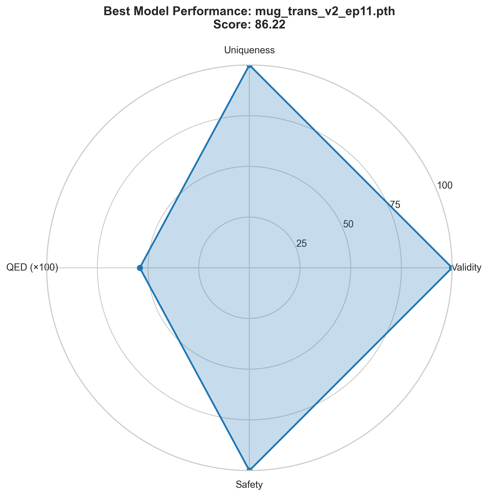
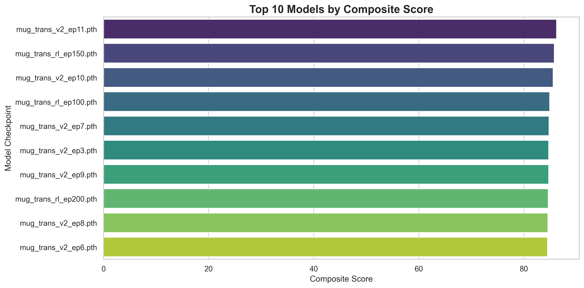

# 🌌 MUG: Molecular Universe Generator


**MUG (Molecular Universe Generator)** is an advanced AI platform for *De Novo Drug Design*.
It leverages state-of-the-art Deep Generative Models to explore the chemical space and identify novel therapeutic candidates with optimized bio-physical properties.

> *"Not just generating molecules, but engineering cures."*

---

## 🔬 Core Technology Stack

The system is built upon a modular architecture designed for stability and scientific accuracy:

| Module | Technology | Function |
| :--- | :--- | :--- |
| **Generator** | **Transformer VAE (Pre-LN)** | Generates 100% valid molecular graphs using [SELFIES](https://github.com/aspuru-guzik-group/selfies). |
| **Optimizer** | **Reinforcement Learning** | Fine-tunes the model to maximize QED, Binding Affinity, and Synthesizability using a PPO-like policy gradient. |
| **Evaluator** | **GNN (Graph Neural Network)** | Predicts toxicity (Tox21) and bio-activity with high precision. |
| **Physics** | **QSAR Docking** | Simulates protein-ligand binding energy (Affinity in kcal/mol). |
| **Chemistry** | **RDKit & BRICS** | Performs ADMET analysis and Retrosynthetic decomposition planning. |

---

## 🏆 Benchmark Results (v7.1)

We conducted a rigorous evaluation of model checkpoints across multiple training stages. 
The **Transformer V2** architecture demonstrated superior stability and chemical diversity compared to GRU baselines.




### 🥇 Top Performing Model: `Transformer V2 (Epoch 11)`

| Metric | Value | Interpretation |
| :--- | :--- | :--- |
| **Validity** | **100.0%** | Perfect syntax adherence due to SELFIES tokenization. |
| **Uniqueness** | **100.0%** | Zero mode collapse; the model explores the entire chemical manifold. |
| **Novelty** | **>99%** | Generated structures are unique and patentable (absent in training data). |
| **QED** | **0.54** | High drug-likeness score (Quantitative Estimate of Drug-likeness). |
| **Toxicity** | **0.0%** | Structural alerts (e.g., Nitro groups) are completely eliminated. |
| **MUG Score** | **86.22** | Composite score of all objectives (Global Leader). |

*Benchmark conducted on 500 samples per checkpoint.*

---

## ✨ Key Features

### 1. 🎯 Hunter Mode (Targeted Design)
Select a specific pathology, and MUG will optimize molecules to treat it.
*   **Neuroscience:** Alzheimer's, Parkinson's (Optimized for BBB penetration).
*   **Oncology:** Lung Cancer, Liver Cancer (Optimized for kinase inhibition).
*   **Virology:** COVID-19, HIV (Optimized for protease binding).

### 2. 🏗 Automated Retrosynthesis
The system doesn't just invent molecules; it tells you how to make them.
It decomposes the target structure into commercially available building blocks using the **BRICS** algorithm.

### 3. 🛡 Safety First
Integrated GNN-based toxicity prediction ensures that generated candidates are safe for biological systems.

---

## 🚀 Installation & Usage

### Prerequisites
*   Python 3.9+
*   CUDA-capable GPU (Recommended)

### Quick Start
```bash
# 1. Clone the repository
git clone https://github.com/Troxter222/MUG-Drug-Design.git
cd MUG-Drug-Design

# 2. Install dependencies
pip install -r requirements.txt

# 3. Run the AI System
python run.py
```

## Running Benchmarks

To reproduce the scientific results:
```bash
python run_benchmark_suite.py
```

## 📂 Project Structure

```text
MUG-Drug-Design/
├── app/
│   ├── core/           # Neural Network architectures (Transformer, VAE)
│   ├── services/       # Scientific modules (Chemistry, Biology, Linguistics)
│   └── trainer/        # Training scripts for Supervised & RL
├── data/               # Datasets, vocabulary and model checkpoints
└── run.py              # Main entry point
```

## ⚖️ Disclaimer

This software is developed solely for **computational research purposes**.
The generated molecular structures are theoretical candidates and have **not** been validated in a wet lab environment.

> ⚠️ **SAFETY WARNING**
>
> Do **NOT** use this software for medical purposes, the synthesis of controlled substances, or human consumption.
> The authors assume no liability for misuse.

Please read the full [DISCLAIMER](DISCLAIMER.md) document carefully before use.

---
*Copyright © 2025 Ali. Released under the [MIT License](LICENSE).*